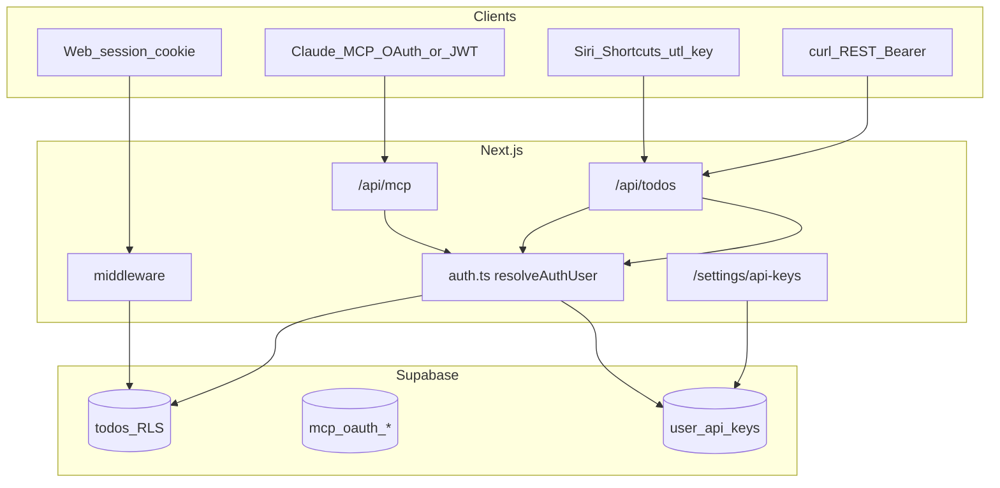

# Agent handoff: unified-todo-list-mcp

Compressed context for continuing work or onboarding another agent. **Read this first.**

## One-liner

Multi-user todo app: **Next.js 16** (Vercel) + **Supabase** (Postgres, Auth, RLS) + **REST** + **remote MCP** + **app-hosted OAuth** (Claude) + **personal API keys** (`utl_…` for Siri/curl). Web UI at `/`.

**Production:** `https://unified-todo-list-mcp.vercel.app`  
**REST:** `https://unified-todo-list-mcp.vercel.app/api/todos`  
**MCP:** `https://unified-todo-list-mcp.vercel.app/api/mcp`

---

## Architecture



| Layer | Auth | DB |
|-------|------|-----|
| Web UI | SSR session cookie | Session client + RLS (`todos-service-web.ts`) |
| REST / MCP | `Authorization: Bearer` **Supabase JWT** OR **`utl_…` API key** | Service role + `userId` from JWT `sub` or `user_api_keys.user_id` |
| OAuth AS | Human login via Supabase; issues JWT at `/oauth/token` | Service role → `mcp_oauth_*` only |
| API key admin | Web session only (`/settings/api-keys`) | Service role → `user_api_keys` |

**IdP:** Supabase Auth. **OAuth AS:** this app (not Supabase `/auth/v1` as AS).

---

## Repo layout (essential)

```
supabase/migrations/          # Run in order in Supabase SQL editor
src/lib/
  auth.ts                     # resolveAuthUser: JWT | utl_ key
  api-keys.ts                 # generate/verify/list/create/revoke utl_ keys
  todos-service.ts            # CRUD; service role + userId
  todos-service-web.ts        # Web: session + RLS
  todo-source.ts              # MCP_SOURCE, WEB_SOURCE, SIRI_SOURCE, DEFAULT_REST_SOURCE
  app-origin.ts               # getSiteOrigin() for UI links
  mcp-oauth/                  # OAuth AS
src/app/
  page.tsx, actions.ts, todo-client.tsx
  login/actions.ts            # signInAction (server) — required for OAuth
  signup/, forgot-password/, reset-password/  # public auth pages
  settings/api-keys/          # API key CRUD UI + Siri instructions
  oauth/, .well-known/
  api/todos/, api/[transport]/route.ts   # MCP at /api/mcp
docs/siri-shortcuts.md        # Apple Shortcuts guide
```

---

## Migrations (run all in order)

| File | Purpose |
|------|---------|
| `20250515120000_create_todos.sql` | `todos` |
| `20250516120000_multi_user_auth.sql` | `user_id` UUID + RLS |
| `20250517120000_mcp_oauth.sql` | `mcp_oauth_clients`, `mcp_oauth_codes` |
| `20250518120000_todo_source.sql` | `todos.source` text NOT NULL (nonempty check) |
| `20250518120001_todo_source_open.sql` | Only if old source migration had enum check |
| `20250519120000_user_api_keys.sql` | `user_api_keys` (`secret` plaintext v1) |

Legacy backfill: `UPDATE public.todos SET user_id = '<uuid>'::uuid WHERE user_id IS NULL;`  
Legacy source backfill (in migration): existing rows → `Claude via MCP`.

---

## Auth details

### Supabase JWT (short-lived)
- `requireAuth` / `verifyMcpBearerToken` → `verifySupabaseAccessToken` (JWKS, issuer, `role: authenticated`).
- Password grant for curl: README.

### Personal API keys `utl_…` (long-lived)
- Table `user_api_keys`: `user_id`, `name`, `secret` (plaintext v1), `revoked_at`, `last_used_at`.
- **Per-user:** each key row maps to one `auth.users.id`; no shared global key.
- **Never** accept `userId` in JSON body for auth.
- Create/list/revoke: `/settings/api-keys` (session cookie). List shows **full secret** every time (v1; defer hash+show-once).
- Siri/curl: `Authorization: Bearer utl_…` on REST and MCP.

### Todo `source` (create only)
| Entry | `source` value |
|-------|----------------|
| MCP `add_todo` | `Claude via MCP` (`MCP_SOURCE`) |
| Web `addTodoAction` | `Web UI` (`WEB_SOURCE`) |
| REST `POST` default | `Website via API` (`DEFAULT_REST_SOURCE`) |
| REST optional body | Any string 1–200 chars (e.g. `Siri via Shortcuts`) |
| Update tools | Do not change `source` |

Constants: `src/lib/todo-source.ts`.

---

## MCP OAuth (Claude Connect)

1. `/.well-known/oauth-protected-resource` → app origin AS  
2. DCR → `/oauth/authorize` (PKCE) → server `signInAction` if no session → code → `/oauth/token` → Supabase JWT  
3. **Do not** use client-side `signInWithPassword` for OAuth (session race → stuck `/login`).

Env: `MCP_OAUTH_CODE_SECRET`, `MCP_OAUTH_ISSUER` (optional).

---

## Siri / Apple Shortcuts

1. Migration `20250519120000_user_api_keys.sql` applied.  
2. Web → **API keys** → create key → copy `utl_…`.  
3. Shortcut: **POST** `{origin}/api/todos`, headers `Authorization: Bearer utl_…`, `Content-Type: application/json`, body `{"name":"…","source":"Siri via Shortcuts"}`.  
4. Page bottom has live **API URL** via `getSiteOrigin()`.

Full steps: [docs/siri-shortcuts.md](docs/siri-shortcuts.md).

---

## REST API

```http
Authorization: Bearer <supabase_jwt | utl_...>
```

| Method | Path | Notes |
|--------|------|-------|
| GET | `/api/todos` | List |
| POST | `/api/todos` | Create; optional `source` |
| PATCH | `/api/todos/:id` | Update / `{ "restore": true }` |
| DELETE | `/api/todos/:id` | Archive |

---

## MCP tools

`list_todos`, `search_todos`, `add_todo`, `update_todo`, `archive_todo`, `delete_todo`, `restore_todo` — scoped to authenticated user (JWT or `utl_`).

---

## Env vars

| Variable | Role |
|----------|------|
| `NEXT_PUBLIC_SUPABASE_URL` / `SUPABASE_URL` | Project URL |
| `NEXT_PUBLIC_SUPABASE_ANON_KEY` | Browser, middleware, OAuth refresh |
| `SUPABASE_SERVICE_ROLE_KEY` | Server DB (**never** `NEXT_PUBLIC_*`) |
| `MCP_OAUTH_CODE_SECRET` | Optional OAuth code encryption |
| `MCP_OAUTH_ISSUER` | Optional fixed public origin |

**Common failures:** wrong key in `SUPABASE_SERVICE_ROLE_KEY`; missing `NEXT_PUBLIC_*` at Vercel build → `MIDDLEWARE_INVOCATION_FAILED`.

---

## Product decisions (locked)

| Topic | Choice |
|-------|--------|
| Users | Public signup at `/signup`; password reset at `/forgot-password` |
| REST/MCP auth | JWT and/or per-user `utl_…` |
| Web status UI | Checkbox = done/undone; ▶ = in progress (`~` prefix); strikethrough = completed |
| Archive | Soft delete + restore |
| Todo source | Create-only, free-form string |
| API keys v1 | Plaintext `secret` in DB; full secret in Settings list |
| Siri | Shortcuts + `utl_…` + `Siri via Shortcuts` source |

---

## Troubleshooting

| Symptom | Fix |
|---------|-----|
| Stuck on `/login` after OAuth | Deploy server `signInAction` |
| `mcp_oauth` / `user_api_keys` errors | Run migrations |
| MCP/REST 401 with `utl_` | Key revoked? Wrong secret? Migration applied? |
| API keys page empty error | Run `20250519120000_user_api_keys.sql` |

---

## Commands

```bash
npm install && npm run dev    # http://localhost:3000
npm run build && npm run lint
```

---

## Deferred

- Hash-only API keys + show-once (replace plaintext `secret`)
- OAuth scopes; full `/oauth/revoke`; social login
- Show `source` in web todo list UI

---

## Docs

- [README.md](README.md) — user setup  
- [docs/siri-shortcuts.md](docs/siri-shortcuts.md) — Shortcuts  
- This file — agent continuity  

---

*Last updated: web status UI (checkbox + in-progress control, `~` / strikethrough cues).*
