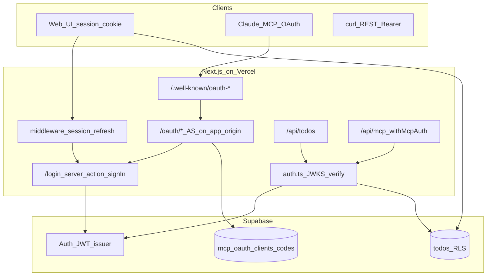

# Agent handoff: unified-todo-list-mcp

Compressed context for continuing work or onboarding another agent. **Read this first.**

## One-liner

Multi-user todo app: **Next.js 16** (Vercel) + **Supabase** (Postgres, Auth, RLS) + **REST** + **remote MCP** with **app-hosted OAuth** (Claude URL-only connect). Web UI at `/`.

**Production:** `https://unified-todo-list-mcp.vercel.app`  
**MCP URL:** `https://unified-todo-list-mcp.vercel.app/api/mcp`

---

## Architecture



| Layer | Auth | DB access |
|-------|------|-----------|
| Web UI | Supabase SSR session cookie | User-scoped client → RLS (`todos-service-web.ts`) |
| REST | `Authorization: Bearer` Supabase JWT | Service role + `userId` from JWT `sub` |
| MCP | Same JWT (via OAuth or manual Bearer) | Same as REST |
| MCP OAuth AS | Issues Supabase `access_token` + `refresh_token` at `/oauth/token` | Service role for `mcp_oauth_*` tables only |

**IdP for credentials:** Supabase Auth. **OAuth authorization server:** this app (not Supabase `/auth/v1` as AS).

---

## Repo layout (essential)

```
supabase/migrations/     # Run in order in Supabase SQL editor
src/
  middleware.ts          # updateSession; public: /api, /oauth, /.well-known, /login, /auth
  lib/
    auth.ts              # JWKS verify; requireAuth; verifyMcpBearerToken
    todos-service.ts     # CRUD; service role + userId filter
    todos-service-web.ts # Web: session client + RLS
    db.ts                # getSupabaseAdmin()
    mcp-oauth/           # OAuth AS implementation (see below)
    supabase/            # env, server/client, middleware, validate-keys
  app/
    page.tsx, actions.ts, todo-client.tsx
    login/               # signInAction (server); OAuth resume via pending cookie
    oauth/               # register, authorize, token, revoke
    .well-known/         # oauth-protected-resource, oauth-authorization-server
    api/todos/, api/[transport]/route.ts  # MCP at /api/mcp
```

---

## Database migrations (all required)

| File | Purpose |
|------|---------|
| `20250515120000_create_todos.sql` | `todos` table |
| `20250516120000_multi_user_auth.sql` | `user_id` UUID, RLS (`auth.uid() = user_id`) |
| `20250517120000_mcp_oauth.sql` | `mcp_oauth_clients`, `mcp_oauth_codes` (service role only; RLS enabled, no policies) |
| `20250518120000_todo_source.sql` | `todos.source` free-form text at create only |
| `20250518120001_todo_source_open.sql` | Drop enum check if old `20250518120000` was applied |

Backfill legacy rows: `UPDATE public.todos SET user_id = '<uuid>'::uuid WHERE user_id IS NULL;`

---

## MCP OAuth flow (implemented)

Matches Marianatek Cousteau pattern: AS on **app origin**, Supabase only for human sign-in.

1. Client reads `GET /.well-known/oauth-protected-resource` → `authorization_servers: [app origin]`, `resource: …/api/mcp`
2. Client reads `GET /.well-known/oauth-authorization-server` → `/oauth/register`, `/oauth/authorize`, `/oauth/token`
3. `POST /oauth/register` (DCR) → `client_id`, stores `redirect_uris`
4. `GET /oauth/authorize?response_type=code&client_id&redirect_uri&code_challenge&code_challenge_method=S256&state`
5. If no session → set httpOnly `mcp_oauth_pending` cookie → redirect `/login?oauth=1`
6. **Sign-in must be server-side** (`src/app/login/actions.ts` `signInAction`) so session cookies exist before `/oauth/authorize` runs
7. Authorized → insert one-time code in `mcp_oauth_codes` (encrypted tokens) → redirect `redirect_uri?code&state`
8. `POST /oauth/token` → `authorization_code` + PKCE → returns Supabase JWT + refresh; `refresh_token` grant calls Supabase refresh

**Tokens at MCP layer:** still Supabase JWTs; `verifyMcpBearerToken` unchanged (JWKS).

**Optional env:** `MCP_OAUTH_CODE_SECRET` (encrypt codes at rest; defaults to service role key), `MCP_OAUTH_ISSUER` (override issuer URL).

**Edge note:** `src/lib/mcp-oauth/pending.ts` is middleware-safe (no Node `crypto`). `crypto.ts` only imported from route handlers / server code, not middleware.

---

## Claude Desktop setup (primary)

1. Settings → Connectors → add remote MCP URL only:
   ```
   https://unified-todo-list-mcp.vercel.app/api/mcp
   ```
2. Click **Connect** → browser opens app `/login` → sign in → should redirect back to Claude.
3. Requires migration `20250517120000_mcp_oauth.sql` applied in Supabase.

**Do not** use client-side `signInWithPassword` for OAuth login (causes session race → stuck on `/login`). Current code uses `signInAction` server action + `redirect()` to `/oauth/authorize`.

---

## Fallback: manual Bearer + mcp-remote

If OAuth fails in a client, paste Supabase JWT:

```bash
curl -sS "$SUPABASE_URL/auth/v1/token?grant_type=password" \
  -H "apikey: $NEXT_PUBLIC_SUPABASE_ANON_KEY" \
  -H "Content-Type: application/json" \
  -d '{"email":"...","password":"..."}' | jq -r .access_token
```

Claude `claude_desktop_config.json`: `mcp-remote` + `Authorization:${TODO_AUTH_HEADER}` where value is `Bearer <token>`. See README.

---

## Env vars

| Variable | Role |
|----------|------|
| `NEXT_PUBLIC_SUPABASE_URL` / `SUPABASE_URL` | Project URL |
| `NEXT_PUBLIC_SUPABASE_ANON_KEY` | Browser, middleware, OAuth token refresh |
| `SUPABASE_SERVICE_ROLE_KEY` | REST/MCP DB, OAuth tables (**never** `NEXT_PUBLIC_*`) |
| `SUPABASE_ANON_KEY` | Optional middleware fallback |
| `MCP_OAUTH_CODE_SECRET` | Optional encryption key for auth codes |
| `MCP_OAUTH_ISSUER` | Optional fixed issuer (else `getPublicOrigin(req)`) |

**Removed:** `API_KEY`.

**Common failures:** anon/publishable key in `SUPABASE_SERVICE_ROLE_KEY`; Stripe key in Supabase slots → "Invalid API Key" on login. Missing `NEXT_PUBLIC_*` at Vercel **build** → `MIDDLEWARE_INVOCATION_FAILED`.

---

## MCP tools

`list_todos`, `search_todos`, `add_todo`, `update_todo`, `archive_todo`, `delete_todo`, `restore_todo` — all scoped to JWT `sub` / session user.

---

## Product decisions (locked)

| Topic | Choice |
|-------|--------|
| Audience | Multi-user; users created manually in Supabase Dashboard |
| REST + MCP credential | Same Supabase JWT Bearer |
| Web status UI | Checkbox: open ↔ completed only; `in_progress` via API/MCP |
| Archive | Soft delete (`archived_at`); restore supported |
| Todo source | Set on create only; free-form string (REST optional, default `Website via API`; MCP/web use fixed defaults) |

---

## Issues fixed (history)

1. Vercel middleware crash — missing public env at build; safe env reads + try/catch.
2. Wrong API keys in `.env` — validate-keys.ts; login "Invalid API Key".
3. Web UI empty — must use session client (RLS), not service role alone.
4. Git secret scan — keys in history; rotate Supabase keys.
5. OAuth metadata pointed at Supabase AS — fixed to app origin.
6. Claude OAuth login loop — client sign-in before server saw session; fixed with server `signInAction`.

---

## Troubleshooting Claude "Connect"

| Symptom | Likely cause | Fix |
|---------|--------------|-----|
| Stays on `/login` after sign-in | Session cookie race (old client login) | Ensure deployed `signInAction` server action is live |
| Red message about `mcp_oauth` migration | Tables missing | Run `20250517120000_mcp_oauth.sql` |
| `invalid_client` / redirect_uri | DCR / URI mismatch | Claude re-registers on connect; check `mcp_oauth_clients` |
| MCP 401 after connect | JWT verify / wrong issuer | Check `SUPABASE_URL`; token must be Supabase JWT |

---

## Commands

```bash
npm install
npm run dev      # http://localhost:3000
npm run build
npm run lint
```

---

## Docs

- User setup: [README.md](README.md)
- This file: agent onboarding / session continuity
- Stale plan (historical): `.cursor/plans/oauth_vs_api_key_8859926f.plan.md` — JWT migration done; use this handoff for OAuth work

---

## Not implemented / deferred

- Personal long-lived MCP API keys (`utl_…`)
- OAuth scopes per tool
- Full `/oauth/revoke` (stub returns 200)
- Public signup / invite emails
- Social login

---

*Last updated: MCP OAuth bridge + server-side OAuth login fix.*
